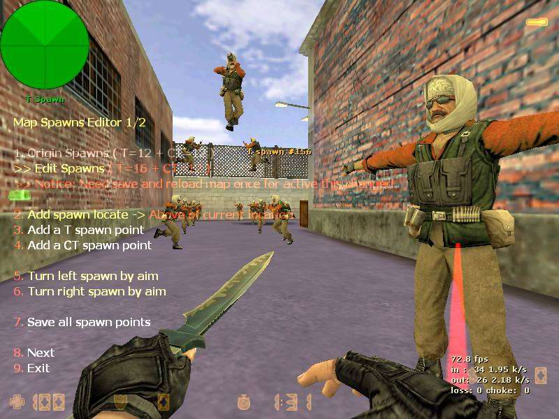

# Map Spawns Editor v1.0 update [2006-10-23]

http://forums.alliedmods.net/showthread.php?t=43660

This plugin let you ( add & del & edit ) map spawns absolute easy.

## What's for

- A lot of map have spawndeath & bad position & less spawns problem I know since I has made a server 5 months.  
How can we fix this? I use some tools todo this but it hard use and do something when you are playing the game.  
I got the way to do this, so I made this plugin.

- How easy? 
  1. One plugin and use one menu you can do all thing.
  1. Edit spawns and shange spawns angle at anytime without restart server or reload map just use save function.
  1. Add & Del spawns just reload map once (you can Del all spawns if you want)

## Requirements

- AMX Mod X 1.76a or greater
- Engine module

## Install Instructions

1. put the lang file Map_Spawns_Editor.amxx to (addons\amxmodx\plugins) folder
1. put the lang file map_spawns_editor.txt to (addons\amxmodx\data\lang) folder

## Description

1. Load the map which need to be edit spawns.
1. Join server with ADMIN_BAN and bind a key with amx_editor_menu command.
1. Type `amx_spawn_editor 1` in console to enable editor function
1. Push your binded key to open editor menu.(all function in menu)
1. Now Add & Del & Edit use menu.(change angle and del spawn you need aim spawn what is need to be made)
1. Finally, select `<save all spawns>` in menu when you finished and the changes will be activated.

NOTICE: If your (Editor Spawns) diff. to (Origina Spawns) that the map needs to be reloaded once to activate your changes.

## Console Commands

- `amx_spawn_editor 1/0` // Enable & Disable Editor Function
- `amx_editor_menu` // open Editor Menu

## Change Log

- [2006-10-23] v1.0  
Rewrite all code, it's almost a new one.  
Fixed the Del spawns can not be less than orgign limit.  
Added change spawn vangle left&right function.  
Added easily create above player spawn function.  
Added auto create (spawns) folder function if it's not exist.  
Added multi-lingual support  
Added Cvar map_spawns record spawns lets HLSW or Server Tools can see how many spawns in that map.

- [2006-08-23] First release. v0.5 [98 downloaded]  
it works but have more bad code

## Credits

help & some code from them
- FreeCode, BAILOPAN, VEN, oneofthedragon 
- and more...

## Screenshots

