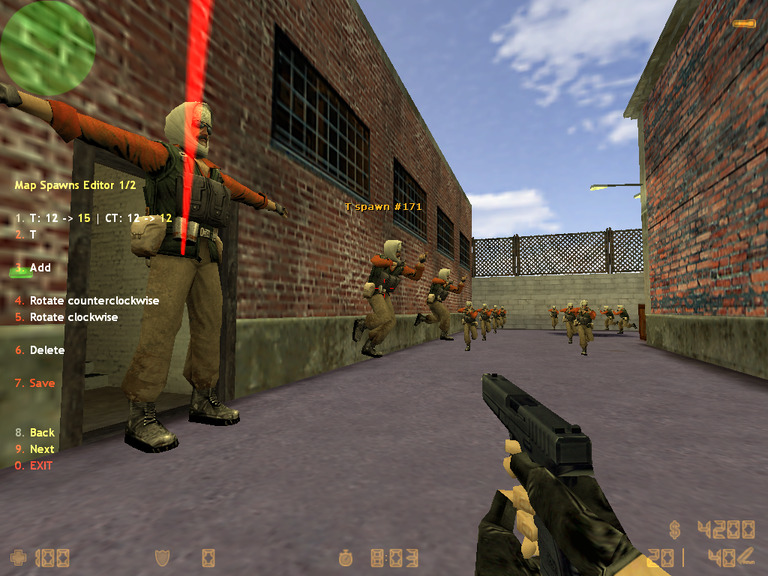
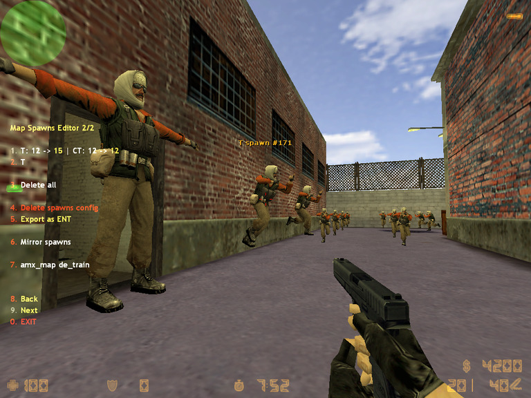

# Map Spawns Editor

## Authors

See [CONTRIBUTORS.md](./CONTRIBUTORS.md)

## Changelog

See [CHANGELOG.md](./CHANGELOG.md)

## Summary

Create, delete and edit spawns.

[Plugin's homepage at AlliedModders](https://forums.alliedmods.net/showthread.php?t=43660)

## Description

A spawn point (Spawn) is a special entity that instructs the game engine on where to teleport the player in the start of the round.

**Map Spawns Editor** lets you control where the spawns are located and how many of them are on the level.

This plugin is useful for fixing bad spawns (e.g., ones that cause telefrag) or mirroring the spawns.

## Hints

- Only one person (with ADMIN_LEVEL_C clearance) can use the plugin at a time.
- Save button turning red is the visual indication of unsaved changes.
- To apply changes press Save and `amx_map <level>`.

## Installation

Download [map_spawns_editor_latest.zip](./dist/map_spawns_editor_latest.zip)

Unzip it to `Half-Life` directory.

Add `Map_Spawns_Editor.amxx` to the end of `cstrike/addons/amxmodx/configs/plugins.ini`.

## Client commands

|Command|Description|
|:-|:-|
|`amx_spawn_editor`|1\|0 to enable\|disable the editor respectively|
|`amx_mse_menu`|open the plugin's menu|

## CVARs

|CVAR|Default|Description|
|:-|:-:|:-|
|`amx_mse_safe_p2p`|100|min distance (in units) between neighbouring points to consider them safe|
|`amx_mse_safe_p2w`|40|min distance (in units) between a world object and a spawn to consider latter one safe|
|`amx_mse_rotation_angle`|30|rotation angle to rotate spawns clockwise and counterclockwise|
|`amx_mse_z_offset`|28|Z offset to apply when creating spawns|
|`amx_mse_unsafe_check`|1|1\|0 to enable\|disable unsafe position check respectively|
